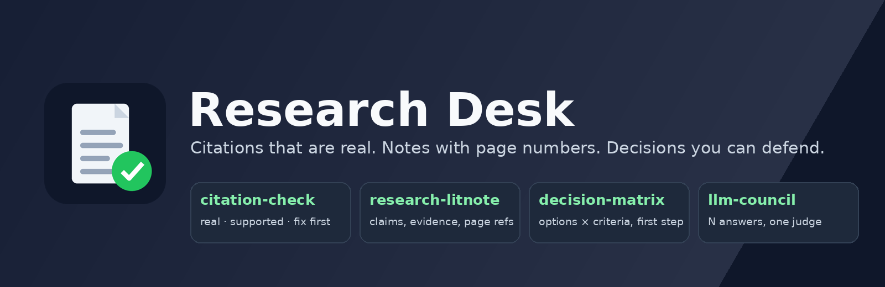

# Research Desk



[](https://github.com/najikay/claude-research-skills/actions/workflows/tests.yml)

**Research work you can stand behind.** Seven skills for the things a student or researcher does every week: check that references are real, take faithful notes on a paper, compare papers, draft related work from your own sources, get your draft reviewed before a referee does, decide between options, and get a second opinion. Plus a small reference checker that looks papers up in OpenAlex and arXiv.

The skills share one habit: **they say what they could not check.** A reference is `verified` only when it was looked up; a claim is `supported` only when the source text was read; a missing citation becomes `[citation needed]`, never an invented one.

## The skills

| Skill | Say something like | What you get |
|---|---|---|
| **citation-check** | "Are these references real?" "Check my citations before I submit." | A table per citation: does it resolve, is the reference real (`verified`, `partial`, `mismatch`, `not_found`, `unchecked`), does the source support the sentence, style. Orphans both ways. What to fix first. |
| **research-litnote** | "Summarise this paper." "Make notes on this PDF." | A structured note: one-line takeaway, problem, method, evidence with page references, limits, quotes. Marked with what it was based on (full text or abstract only). |
| **paper-compare** | "Compare these three papers." "Which should be my baseline?" | A side-by-side table with the numbers copied from each paper and where they stand, what each adds, which to cite for what, and a plain "not directly comparable" when benchmarks differ. |
| **related-work** | "Draft my related work from these notes." | A themed section where every sentence carries one of *your* sources, ending on the gap your work fills, with a list of every `[citation needed]`. |
| **paper-critique** | "Review my draft." "What will reviewers say?" | Each claim against its evidence, missing baselines and ablations, statistical weak points, threats to validity, ranked with a concrete fix each, and the three changes that matter most. |
| **decision-matrix** | "Help me decide between these offers." | Options against weighted criteria with a reason per score, what would flip the result, a recommendation and a reversible first step. The decision stays yours. |
| **llm-council** | "Give me a second opinion." "Argue both sides." | Several independent answers, then a judge: agreements, disagreements, claims to verify, a final answer with a confidence. |

## Where it runs

| | Claude apps (web, desktop, mobile) | Claude Code and Cowork |
|---|---|---|
| The seven skills | yes | yes |
| Looking references up | through the hosted reference checker (the same checker, served from `research-desk-checker.fly.dev`); web search as the fallback | through the bundled reference checker (below); needs Python 3.10+, see Platforms |
| Saving notes as files | the note comes in the reply, ready to copy | saved in the folder you choose |

Without web search and without the checker, citation-check still finds orphans and suspicious entries, flags claims it cannot check as `unverified`, and marks every reference `unchecked` instead of guessing.

## The hosted checker

Since 0.4 the checker also runs as a small web service, so references are verified in the Claude apps too. It is the same code (`servers/reference_lookup/remote.py` wraps `server.py` in MCP's Streamable HTTP transport), stateless, with nothing stored and a rate limit per client; see `hosting/README.md` to run your own copy. What it receives and where it goes is in [PRIVACY.md](PRIVACY.md).

## The reference-lookup server

`servers/reference_lookup/server.py` is a stdio MCP server in standard-library Python (3.10+, no packages to install). It gives Claude five tools:

| tool | what it does |
|---|---|
| `verify_reference` | one reference (title, authors, year, DOI, arXiv id) → `verified` (title, first author, year agree) / `partial` (title agrees; year off or no authors given) / `mismatch` (wrong author or title, or an identifier that points elsewhere) / `not_found` / `unchecked`, with the matched record and the reasons |
| `verify_bibtex` | the same for every entry of a `.bib` text, with counts |
| `lookup_reference` | clean metadata for a DOI, arXiv id or OpenAlex id |
| `search_works` | candidate papers for a few search words (OpenAlex searches titles, abstracts and full text) |
| `citation_neighbours` | what a paper cites and the most-cited papers citing it |

It asks two public, keyless services: [OpenAlex](https://openalex.org) (works by DOI or title) and [arXiv](https://arxiv.org) (arXiv ids), one request at a time, with arXiv's one-call-per-three-seconds rule respected. There is no account, key or storage.

**Data handling** (the full statement is in [Privacy](PRIVACY.md))**.** The server itself never sees your draft; Claude passes it a reference's title, DOI or arXiv id, or a few search words for `search_works`. Those go to `api.openalex.org` and `export.arxiv.org`, which see the request as any web request (your address, the plugin's user agent). Nothing is kept by the plugin. No personal data is read or stored. Author names in a bibliography are public bibliographic data and are sent only to match the paper.

In the Claude apps the checker does not run. There, citation-check looks references up through Claude's web search, which sends a reference's title, DOI or arXiv id as a search; related-work may search a topic phrase for a missing citation. Neither sends sentences from your draft or a description of your unpublished work.

**Platforms.** Python 3.10 or newer on the PATH as `python3` (on Windows, install Python from python.org and tick "Add to PATH"; if only `python` exists, change the command in `.mcp.json`).

## Install

From the Claude directory: search for Research Desk. In Claude Code:

```
/plugin marketplace add najikay/claude-research-skills
/plugin install research-desk@claude-research-skills
```

## Tests and evals

- `python -m pytest -q` runs the reference checker's offline tests (every HTTP call replaced by a fake) and a check that every skill's frontmatter is valid; CI runs them on Linux and Windows.
- `evals/` holds one case per skill: a prompt with a small inlined draft, bibliography or paper excerpt, and a grader. `claude plugin eval .` runs each case with the plugin and without it.
- `evals/citation-check-tools` is the one case that uses the reference checker's tools. A stand-in answers the tool calls from recordings (`mocks/`), so the run needs no network. It passed five checks in three of three runs with the plugin (judge: Sonnet, 2026-10-05): the tool was called, the verdicts match what the tools returned, citation and bibliography mismatches are reported, a real reference is not taken as proof of the sentence citing it, and the one quote available is used.

Last run (Claude Code 2.1.288, three runs per case and arm, 2026-10-05):

| Case | With the plugin | Without |
|---|---|---|
| citation-check | 1.00 | 0.33 |
| research-litnote | 1.00 | 0.00 |
| paper-compare | 1.00 | 0.33 |
| related-work | 1.00 | 0.00 |
| paper-critique | 1.00 | 0.00 |
| decision-matrix | 1.00 | 0.00 |
| llm-council | 1.00 | 1.00 |

Claude runs a good council on request without the plugin; that skill's value is that it fires when a second opinion is called for and reports in a fixed shape. All seven cases run with no tools, so they test what the skills do in a plain chat; the web-search and reference-checker routes are covered by the checker's own tests, not by these cases.

Each case is built so that a plausible-sounding answer fails: a reference list with an invented entry and an orphan, three papers on two different benchmarks, a related-work request that tempts a citation from memory, a draft that claims significance from one run.

## Author

Naji Kayal, University of Haifa (robotics, SLAM, computer vision). Issues and suggestions are welcome here.

## License

Apache-2.0. See `LICENSE`. See `CHANGELOG.md` for versions.
